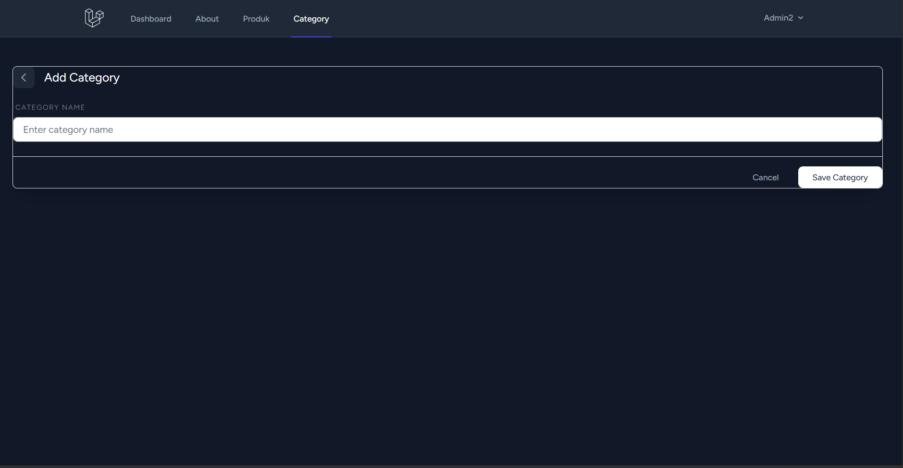

# Laporan Progress Project - UCP 1

**Nama :**
**NIM :**
**Kelas :**

## 1. Daftar Kategori (Category List)
Halaman ini menampilkan seluruh kategori produk yang telah terdaftar dalam sistem. Terdapat kolom untuk nama kategori, jumlah produk yang terkait, serta aksi untuk mengedit atau menghapus kategori.

## 2. Tambah Produk (Add Product)
Halaman formulir untuk menambahkan produk baru ke dalam sistem. Pengguna dapat mengisi nama produk, jumlah stok, harga, dan memilih kategori yang relevan melalui menu dropdown yang datanya diambil dari tabel kategori.

## 3. Tambah Kategori (Add Category)
Halaman untuk membuat kategori baru. Sesuai dengan pembaruan terakhir, input "Total Product" telah dihapus dari formulir ini agar data lebih bersih dan fokus pada input nama kategori saja.

